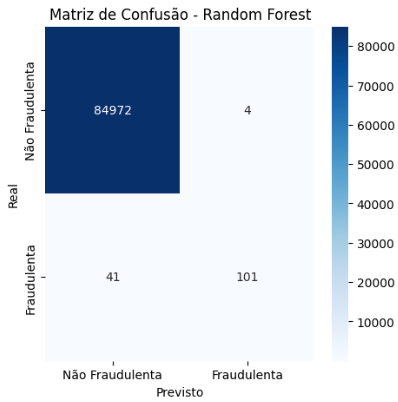
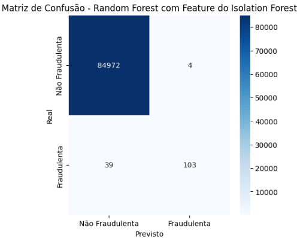
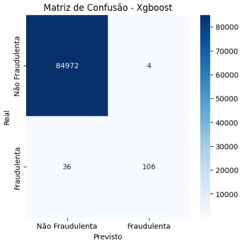

# 🛡️ Credit Card Fraud Detection - Machine Learning

Este projeto implementa e compara diferentes algoritmos de **aprendizado de máquina** para detecção de transações fraudulentas em um cenário **altamente desbalanceado**.  

📌 Desenvolvido como parte de uma disciplina de **Inteligência Artificial** na **UTFPR - Apucarana**.

---

## 📊 Objetivo
Identificar padrões em transações financeiras e classificar transações como legítimas ou fraudulentas, analisando o desempenho de diferentes algoritmos.

---

## 📂 Dataset
- **Fonte:** [Credit Card Fraud Detection Dataset (Kaggle)](https://www.kaggle.com/datasets/mlg-ulb/creditcardfraud)
- **Total de transações:** 284.807  
- **Fraudes:** 492 (0,172% do total)
- **Features:** 31 (incluindo 28 variáveis anonimizadas via PCA)

---

## 🔧 Tecnologias Utilizadas
- **Linguagem:** Python  
- **Bibliotecas:** Pandas, NumPy, Matplotlib, Seaborn, Scikit-learn, XGBoost

---

## 📌 Metodologia
1. **Análise Exploratória (EDA)** — visualização da distribuição das variáveis e identificação de desbalanceamento.  
2. **Pré-processamento** — escalonamento de variáveis, ajuste de pesos de classes, tratamento do desbalanceamento.  
3. **Treinamento** — divisão dos dados (70% treino, 30% teste).  
4. **Avaliação** — uso de métricas como *Accuracy*, *Precision*, *Recall* e *F1-score*.  

---

## 🤖 Modelos Testados
- Random Forest
- Random Forest + Isolation Forest
- XGBoost
- Regressão Logística (baseline)

---

## 📈 Resultados

| Modelo                          | Acurácia | Precisão | Recall | F1-score |
|--------------------------------|----------|----------|--------|----------|
| Random Forest                  | 1.00     | 0.96     | 0.71   | 0.82     |
| Random Forest + IsolationForest| 1.00     | 0.96     | 0.73   | 0.83     |
| **XGBoost**                    | **1.00** | **0.96** | **0.75** | **0.84** |
| Regressão Logística             | 0.97     | 0.05     | 0.89   | 0.10     |

---

## 📊 Matrizes de Confusão
📌 *Substitua os exemplos abaixo pelas imagens reais geradas durante o treinamento.*

**Random Forest**  

**Random Forest + Isolation Forest**  

**XGBoost**  

**Regressão Logística**  

---

## 🔍 Conclusões
- **Melhor modelo:** `XGBoost` (F1-score = 0.84), alcançando bom equilíbrio entre *precision* e *recall*.  
- **Combinação de modelos** (Random Forest + Isolation Forest) apresentou melhora no recall sem perder precisão.  
- **Regressão Logística** teve baixo desempenho devido ao grande número de falsos positivos.  
- Algoritmos baseados em árvores e boosting mostraram-se mais adequados para bases altamente desbalanceadas.

---

## 👨‍💻 Autores
- Mabylly Kauany Neres da Silva  
- Murilo Vital Rondina  
- Ruan Mateus Trizotti
